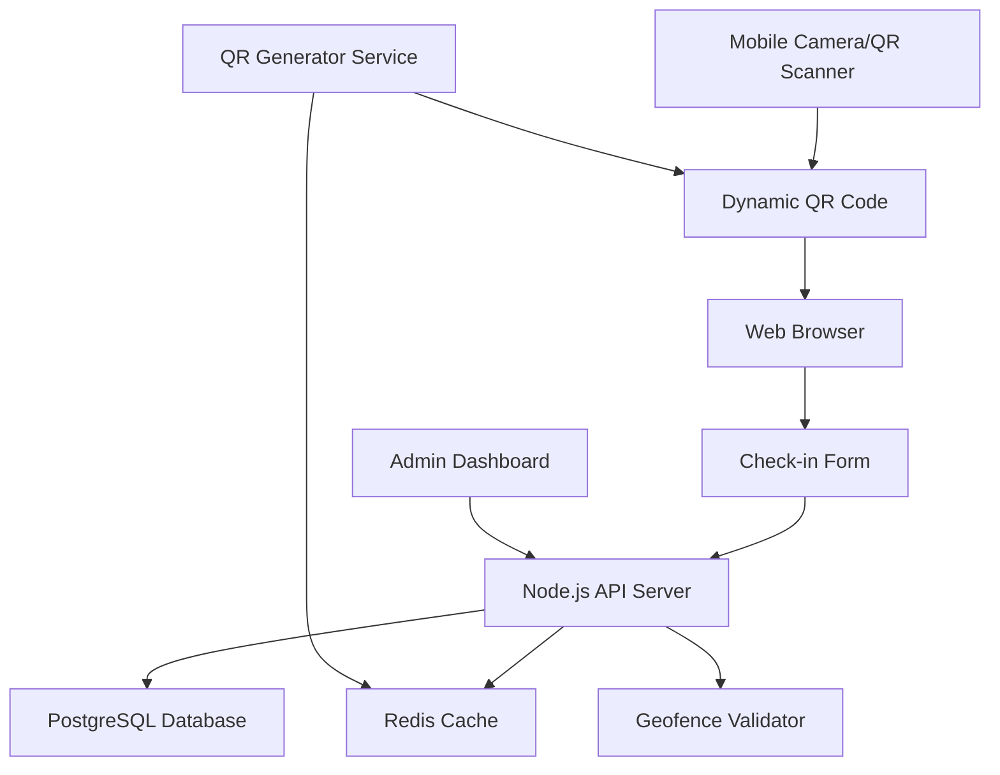

# Design Document

## Overview

The QR Check-in System is a web-based solution that enables event attendees to check in by scanning QR codes with their mobile devices without installing any applications. The system consists of a Node.js backend API, a PostgreSQL database, Redis cache, and a responsive web frontend for both user check-in forms and admin dashboard.

## Architecture

### High-Level Architecture



### Technology Stack

**Backend:**
- Node.js with Express.js framework
- PostgreSQL for persistent data storage
- Redis for QR code caching and session management
- JWT for admin authentication
- WebSocket for real-time dashboard updates

**Frontend:**
- Vanilla JavaScript/HTML5 for check-in forms (lightweight, fast loading)
- React.js for admin dashboard (rich interactions)
- Progressive Web App (PWA) capabilities for offline form caching

**Infrastructure:**
- Docker containers for deployment
- Nginx reverse proxy for load balancing
- SSL/TLS encryption for all communications

## Components and Interfaces

### 1. QR Code Generator Service

**Purpose:** Generates dynamic QR codes with time-based expiration

**Key Methods:**
```javascript
class QRCodeGenerator {
  generateQRCode(eventId, expirationSeconds = 60)
  validateQRCode(qrToken, eventId)
  refreshQRCode(eventId)
  getActiveQRCode(eventId)
}
```

**QR Code Format:**
```
https://domain.com/checkin?event={eventId}&token={encryptedToken}&ts={timestamp}
```

**Token Structure:**
- Encrypted payload containing: eventId, timestamp, nonce
- AES-256 encryption with rotating keys
- Base64URL encoding for URL safety

### 2. Check-in Form Handler

**Purpose:** Processes user check-in submissions with validation

**API Endpoints:**
```javascript
POST /api/checkin/submit
GET /api/checkin/form/:eventId/:token
POST /api/checkin/upload-selfie
```

**Form Data Structure:**
```javascript
{
  eventId: string,
  qrToken: string,
  userData: {
    name: string,
    email: string,
    idNumber: string,
    selfieUrl?: string
  },
  location: {
    latitude: number,
    longitude: number,
    accuracy: number
  },
  timestamp: number
}
```

### 3. Geofence Validator

**Purpose:** Validates user location against event boundaries

**Key Methods:**
```javascript
class GeofenceValidator {
  isPointInCircle(lat, lng, centerLat, centerLng, radius)
  isPointInPolygon(lat, lng, polygonPoints)
  calculateDistance(lat1, lng1, lat2, lng2)
  validateLocation(eventId, userLat, userLng)
}
```

**Geofence Types:**
- Circular: center point + radius in meters
- Polygon: array of lat/lng coordinate pairs
- Multiple zones: union of multiple geofences

### 4. Admin Dashboard API

**Purpose:** Provides real-time monitoring and reporting capabilities

**API Endpoints:**
```javascript
GET /api/admin/events
POST /api/admin/events
PUT /api/admin/events/:id
GET /api/admin/checkins/:eventId
GET /api/admin/analytics/:eventId
POST /api/admin/export/:eventId
WebSocket /ws/admin/realtime
```

### 5. Event Management Service

**Purpose:** Manages event lifecycle and configuration

**Key Methods:**
```javascript
class EventService {
  createEvent(eventData, geofenceConfig)
  updateEvent(eventId, updates)
  getEventDetails(eventId)
  activateEvent(eventId)
  deactivateEvent(eventId)
}
```

## Data Models

### Event Model
```javascript
{
  id: UUID,
  name: string,
  description: string,
  startTime: timestamp,
  endTime: timestamp,
  geofence: {
    type: 'circle' | 'polygon',
    coordinates: object,
    radius?: number
  },
  qrSettings: {
    expirationSeconds: number,
    allowReuse: boolean
  },
  isActive: boolean,
  createdBy: UUID,
  createdAt: timestamp,
  updatedAt: timestamp
}
```

### Check-in Record Model
```javascript
{
  id: UUID,
  eventId: UUID,
  userData: {
    name: string,
    email: string,
    idNumber: string,
    selfieUrl?: string
  },
  location: {
    latitude: number,
    longitude: number,
    accuracy: number
  },
  qrToken: string,
  checkinTime: timestamp,
  ipAddress: string,
  userAgent: string,
  validationStatus: 'success' | 'failed',
  validationErrors?: array
}
```

### QR Code Cache Model (Redis)
```javascript
{
  key: `qr:${eventId}:${token}`,
  value: {
    eventId: UUID,
    token: string,
    createdAt: timestamp,
    expiresAt: timestamp,
    isUsed: boolean
  },
  ttl: expirationSeconds
}
```

## Error Handling

### Error Categories and Responses

**QR Code Errors:**
```javascript
{
  code: 'QR_EXPIRED',
  message: 'QR code has expired. Please scan a new code.',
  action: 'refresh_qr'
}
```

**Location Errors:**
```javascript
{
  code: 'OUTSIDE_GEOFENCE',
  message: 'You are outside the event area.',
  details: {
    userDistance: number,
    allowedRadius: number
  }
}
```

**Validation Errors:**
```javascript
{
  code: 'VALIDATION_FAILED',
  message: 'Form validation failed',
  fieldErrors: {
    email: 'Invalid email format',
    name: 'Name is required'
  }
}
```

### Error Recovery Strategies

1. **QR Expiration:** Provide "Scan Again" button that refreshes the page
2. **Location Denial:** Allow form submission with warning message
3. **Network Issues:** Cache form data locally and retry submission
4. **Server Errors:** Display user-friendly messages with retry options

## Testing Strategy

### Unit Testing
- QR code generation and validation logic
- Geofence calculation algorithms
- Form validation functions
- Database model operations

### Integration Testing
- API endpoint functionality
- Database transactions
- Redis cache operations
- File upload handling

### End-to-End Testing
- Complete user check-in flow
- Admin dashboard operations
- Real-time updates
- Mobile browser compatibility

### Performance Testing
- Concurrent QR code scanning
- Database query optimization
- Redis cache performance
- Form submission under load

### Security Testing
- QR code token encryption/decryption
- SQL injection prevention
- XSS protection in forms
- Rate limiting effectiveness

### Mobile Testing
- iOS Safari compatibility
- Android Chrome compatibility
- Various screen sizes and orientations
- Touch interface usability
- Camera permission handling

### Accessibility Testing
- Screen reader compatibility
- Keyboard navigation
- Color contrast ratios
- ARIA label correctness
- Form error announcements